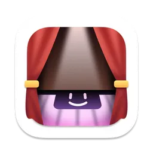

<p align="center">
  
</p>

<h1 align="center">DropNest 🪺</h1>

<p align="center">
  把 MacBook 的刘海变成一块实用的悬浮面板：拖文件暂存，看正在播放的音乐。
</p>

<p align="center">
  <a href="LICENSE"></a>
  
  
  
</p>

> ⚠️ **许可证**：本项目派生自 [boring.notch](https://github.com/TheBoredTeam/boringnotch)（GPL-3.0）。依据 GPL「衍生作品」条款，DropNest 同样以 **GPL-3.0** 发布，必须保留原许可证与版权信息。详见 [`LICENSE`](LICENSE) 与 [`THIRD_PARTY_LICENSES`](THIRD_PARTY_LICENSES)。

---

## 功能特性

### 刘海媒体条（Now Playing）

- 当系统正在播放音乐时，刘海区域两侧展开，显示**专辑封面**与**动态频谱动画**。
- 暂停 / 停止后自动收起为细条，不遮挡屏幕内容。
- 通过系统级媒体接口获取播放状态，**支持任意播放器**（Apple Music、Spotify、网页播放器等），不依赖单一 App。

### 文件暂存（Shelf）

把文件拖到刘海区域即可「钉」在刘海上，随时取用，相当于一个悬浮的临时收纳区：

- **拖入即收**：文件拖到刘海上方自动展开收纳，松开后收入面板。
- **安全书签持久化**：使用系统安全范围书签（security-scoped bookmark），**重启应用后文件引用不丢失**。
- **单项右键菜单**：打开 / 用其他应用打开 / 在访达中显示 / 快速查看（Quick Look）/ 分享 / 复制 / 重命名 / 移除。
- **图片专属操作**：移除背景（抠图）/ 转换图片格式 / 创建 PDF。
- **文件夹操作**：可直接压缩为 zip。
- 每项均有缩略图预览。

### 交互方式

- **悬停展开**：鼠标移到刘海上方自动展开面板。
- **双指手势开合**：触控板双指开合控制面板展开 / 收起。
- **拖拽检测区域可调**：可在设置中调整刘海拖拽感应区域的大小与灵敏度。

### 设置

提供独立的设置窗口（通用 / 外观 / 媒体 / 文件架 / 关于 等分页），可微调刘海行为、外观、媒体显示与 Shelf 相关选项，并支持**登录时自动启动**。

### 与原版（boring.notch）的功能范围差异

> 出于个人使用场景的取舍，DropNest 未包含原 boring.notch 中的以下模块：
> 日历 / 提醒事项、电池指示、摄像头镜像、系统 HUD 替换、下载指示器、歌词与可视化器、自动更新、Onboarding 引导等。
> 这些能力在原项目中同样完善，仅是本个人分支未纳入，以让体量更精简、更聚焦于核心场景。

---

## 系统要求

| 项目 | 要求 |
| --- | --- |
| 操作系统 | macOS 14 Sonoma 或更高 |
| 芯片 | Apple Silicon 或 Intel Mac 均可 |
| 构建工具 | Xcode 15 及以上（需支持 Swift 严格并发与下文所列 SPM 依赖） |
| 运行形态 | 沙盒化 App，无需关闭 SIP |

---

## 技术栈与依赖

- **语言 / 框架**：Swift 5（启用严格并发 `SWIFT_STRICT_CONCURRENCY = targeted`）+ SwiftUI。
- **窗口体系**：基于 [SkyLightWindow](https://github.com/Lakr233/SkyLightWindow) 创建无边框、贴合刘海形状的原生窗口，支持多显示器。
- **媒体监听**：通过 [mediaremote-adapter](https://github.com/ungive/mediaremote-adapter)（Perl 脚本 + `MediaRemoteAdapter.framework` 子进程）流式获取系统级 Now Playing 状态。
- **偏好存储**：[Defaults](https://github.com/sindresorhus/Defaults)。
- **登录启动**：[LaunchAtLogin-Modern](https://github.com/sindresorhus/LaunchAtLogin-Modern)。
- **Swift 语法支持**：[swift-syntax](https://github.com/swiftlang/swift-syntax)。
- **包管理**：Xcode 内置 Swift Package Manager（SPM）。
- **DMG 打包**：`dmgbuild`（Python，见 `Configuration/dmg`）。

---

## 安装

### 方式一：下载安装包（如有提供）

若仓库 Release 中提供了 `.dmg`，直接挂载后把 `DropNest.app` 拖入 `应用程序` 文件夹即可。

### 方式二：从源码构建

见下一节。构建产物 `DropNest.app` 可在 `Products/` 或 Xcode 的 `DerivedData` 中找到，拷到 `应用程序` 即可使用。

---

## 从源码构建

### 前置要求

- 已安装 **Xcode 15+**（App Store 或 [developer.apple.com](https://developer.apple.com/xcode/)）。
- 已安装 **Xcode Command Line Tools**：`xcode-select --install`。
- （仅构建 DMG 时需要）**Python 3**，用于安装 `dmgbuild`。

### 用 Xcode 运行 / 构建（推荐）

1. 双击打开 `DropNest.xcodeproj`。
2. 在顶部工具栏选择 **DropNest** 作为 Target / Scheme。
3. 连接一台 Mac（或选择 `My Mac` 作为运行目标）。
4. 按 **⌘R** 直接运行；或 **⌘B** 仅构建。
5. 构建完成后，在 Xcode 的 `Products` 组中右键 `DropNest.app` → **Show in Finder** 取出 App。

### 用命令行构建

```bash
# 若 Xcode 尚未生成共享 Scheme，可先打开一次 Xcode 触发生成；
# 之后可用 -scheme；也可直接指定 -target。
xcodebuild \
  -project DropNest.xcodeproj \
  -scheme DropNest \
  -configuration Release \
  -destination 'platform=macOS' \
  build
```

> 提示：仓库未包含共享 Scheme（`.xcschemes`），首次请先通过 Xcode 打开工程以生成本地 Scheme；或直接用 `-target DropNest` 代替 `-scheme DropNest`。

### 构建 DMG 安装包

DMG 打包脚本位于 `Configuration/dmg/`：

```bash
cd Configuration/dmg
python3 -m venv .venv && source .venv/bin/activate   # 可选，隔离依赖
pip install -r requirements.txt                        # 安装 dmgbuild 等
python3 dmgbuild_settings.py                           # 按配置生成 DMG
# 或直接运行打包脚本：
# ./create_dmg.sh
```

生成的 DMG 会包含窗口背景图（`.background/background.tiff`）等定制化元素。

---

## 使用说明

### 首次启动

1. 从 `应用程序` 文件夹启动 **DropNest**（首次启动可能被 macOS 拦截，见[常见问题](#常见问题)）。
2. 由于启用了 **App Sandbox**，Shelf 通过「安全范围书签」访问你拖入的文件，无需额外授予「完全磁盘访问」等敏感权限。
3. 建议在设置中开启「登录时启动」，避免每次手动打开。

### 文件暂存（Shelf）

- **拖入**：把任意文件 / 文件夹拖到屏幕顶部刘海区域，面板自动展开并收纳。
- **取出**：悬停展开后，单击文件用默认程序打开；右键调出菜单：
  - 打开 / 用其他应用打开
  - 在访达中显示
  - 快速查看（Quick Look 预览）
  - 分享
  - 复制 / 重命名 / 移除
- **图片处理**：选中图片后可「移除背景」「转换图片格式」「创建 PDF」。
- **文件夹**：右键可直接压缩为 zip。
- **持久化**：收纳的文件引用会被安全书签记录，重启 DropNest 后依然可用。

### 媒体条

- 播放音乐时，刘海两侧出现专辑封面与动态频谱；暂停后自动收起。
- 媒体显示行为（是否显示封面、频谱等）可在设置「媒体」分页中调整。

### 设置

打开设置窗口（菜单栏图标或快捷键），分页包括：

- **通用**：登录启动、基础行为等。
- **外观**：刘海面板样式相关。
- **媒体**：Now Playing 显示选项。
- **文件架**：Shelf 容量、默认操作等。
- **关于**：版本与许可证信息。

---

## 权限与沙盒

DropNest 是**沙盒化应用**，其权限声明见 `boringNotch/DropNest.entitlements`：

| 权限 | 用途 |
| --- | --- |
| `com.apple.security.app-sandbox` | 启用 App 沙盒，提升安全性 |
| `com.apple.security.files.bookmarks.app-scope` | Shelf 用 App 级安全书签持久化文件引用 |
| `com.apple.security.files.bookmarks.document-scope` | Shelf 用文档级安全书签持久化文件引用 |
| `com.apple.security.files.user-selected.read-write` | 处理用户主动拖入 / 选择的文件 |

> 正因为使用安全范围书签而非请求「完全磁盘访问」，DropNest 不需要你在「系统设置 → 隐私与安全性」里授予任何高危权限。

---

## 目录结构

源码目录名为 **`boringNotch/`**（并非 `DropNest/`，历史命名保留未改）：

```
DropNest/
├── boringNotch/                     # 源码主目录
│   ├── DropNestApp.swift            # 应用入口：刘海窗口与拖拽检测管理
│   ├── ContentView.swift            # 刘海整体布局（收起媒体条 / 展开 Shelf）
│   ├── NotchViewCoordinator.swift   # 刘海视图协调
│   ├── DropNest.entitlements        # 沙盒与文件权限声明
│   ├── Info.plist                   # 应用 Info 配置
│   ├── Localizable.xcstrings        # 本地化字符串（含中文）
│   ├── Assets.xcassets/             # 图标与图片资源
│   ├── components/
│   │   ├── Notch/                   # 刘海窗口、形状、头部、频谱
│   │   ├── Shelf/                   # 文件暂存模块
│   │   │   ├── Models/              # Bookmark、ShelfItem
│   │   │   ├── Services/            # 拖放/持久化/图片处理/QuickLook/缩略图
│   │   │   ├── ViewModels/
│   │   │   └── Views/               # ShelfView、ShelfItemView、DragPreviewView
│   │   └── Settings/                # 设置界面（SettingsView 等）
│   ├── managers/                    # MusicManager（Now Playing 监听）等
│   ├── MediaControllers/            # NowPlayingController（mediaremote-adapter 封装）
│   ├── observers/                   # DragDetector（刘海拖拽检测）
│   ├── sizing/                      # 刘海尺寸计算
│   ├── models/  enums/  extensions/  helpers/  utils/  private/  animations/
├── mediaremote-adapter/             # 媒体监听子模块（Perl 脚本 + Framework）
│   ├── MediaRemoteAdapter.framework
│   ├── MediaRemoteAdapterTestClient
│   └── mediaremote-adapter.pl
├── Configuration/
│   └── dmg/                         # DMG 打包配置（dmgbuild）
│       ├── create_dmg.sh
│       ├── dmgbuild_settings.py
│       ├── requirements.txt
│       └── .background/background.tiff
├── DropNest.xcodeproj/              # Xcode 工程
├── LICENSE                          # GPL-3.0 许可证
├── THIRD_PARTY_LICENSES             # 第三方依赖许可证汇总
└── README.md
```

> 注：Xcode 工程中 `PRODUCT_NAME` 为 `DropNest`，`MARKETING_VERSION` 为 `2.7.3`，`PRODUCT_BUNDLE_IDENTIFIER` 目前仍沿用原项目的 `theboringteam.boringnotch`。若要以独立身份分发，建议改为你自己的反向域名（如 `com.yourname.dropnest`）。

---

## 常见问题

**Q：启动时提示「无法打开，因为无法验证开发者」？**
A：macOS 对未签名 / 未公证的 App 会拦截。可右键 App → 「打开」，在弹窗中确认；或在「系统设置 → 隐私与安全性」中点击「仍要打开」。自行构建的版本不会出现此问题（由你的开发者环境签名）。

**Q：Shelf 里的文件重启后打不开了？**
A：极少数情况下安全书签可能失效（例如文件被移动 / 删除）。重新拖入该文件即可。DropNest 已通过 `files.bookmarks` 权限尽量保证持久化。

**Q：为什么没有电池 / 日历 / 歌词？**
A：这些是原 boring.notch 的功能，已在 DropNest 中刻意裁剪，只保留 Shelf 与媒体条两项核心能力。

**Q：刘海拖拽不灵敏？**
A：在设置中调整「拖拽检测区域」的大小与灵敏度。

---

## 卸载

1. 退出 DropNest（菜单栏图标 → 退出）。
2. 将 `应用程序/DropNest.app` 拖入废纸篓。
3. （可选）删除偏好文件：`~/Library/Containers/theboringteam.boringnotch/`（路径对应 bundle id）。
4. 若开启了登录启动，在「系统设置 → 通用 → 登录项」中移除 DropNest。

---

## 许可证

本项目以 **GNU General Public License v3.0（GPL-3.0）** 发布。

- 完整许可证文本见 [`LICENSE`](LICENSE)。
- 第三方依赖的许可证汇总见 [`THIRD_PARTY_LICENSES`](THIRD_PARTY_LICENSES)（含 MediaRemoteAdapter 的 BSD-3-Clause 等）。
- 因本项目派生于 GPL-3.0 的 boring.notch，**你必须在此许可证下使用、修改与分发本软件**；任何再分发都需附带对应源码。

---

## 致谢

- [TheBoredTeam/boring.notch](https://github.com/TheBoredTeam/boringnotch) —— DropNest 的源头项目，提供了刘海窗口的完整思路与实现基础。
- [ungive/mediaremote-adapter](https://github.com/ungive/mediaremote-adapter) —— 系统级媒体状态获取能力。
- [Lakr233/SkyLightWindow](https://github.com/Lakr233/SkyLightWindow)、[sindresorhus/Defaults](https://github.com/sindresorhus/Defaults)、[sindresorhus/LaunchAtLogin-Modern](https://github.com/sindresorhus/LaunchAtLogin-Modern)、[swiftlang/swift-syntax](https://github.com/swiftlang/swift-syntax) —— 本项目依赖的开源库。
